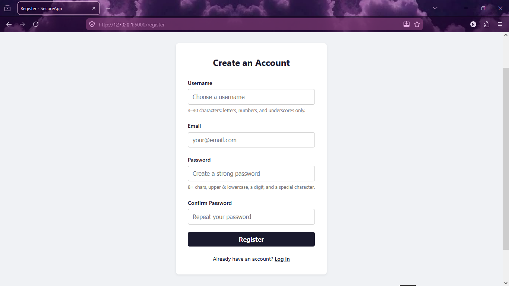
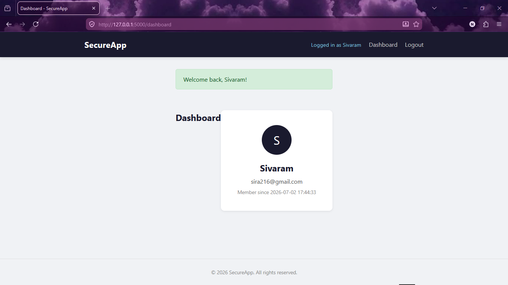

# 🔐 Secure Login System

A secure web-based authentication system built with **Flask**, **SQLite**, and **bcrypt**. This application provides user registration, secure login, password hashing, session management, and input validation to protect against common web security attacks.

---

## 📌 Features

- 🔑 User Registration
- 🔒 Secure Login Authentication
- 🔐 Password Hashing using bcrypt
- 📧 Email Validation
- ✅ Username & Password Validation
- 🛡️ SQL Injection Protection (Parameterized Queries)
- 🍪 Secure Session Management
- 🚪 Logout Functionality
- ⚠️ Flash Messages for User Feedback
- 💾 SQLite Database Integration
- 🎨 Responsive User Interface

---

## 🛠️ Technologies Used

### Backend
- Python 3
- Flask

### Frontend
- HTML5
- CSS3
- Jinja2 Templates

### Database
- SQLite

### Security Libraries
- bcrypt
- Flask-Session
- python-dotenv
- email-validator

---

## 📂 Project Structure

```text
Secure-Login-System/
│
├── app.py
├── requirements.txt
├── README.md
├── .gitignore
├── LICENSE
├── .env.example
│
├── templates/
│   ├── base.html
│   ├── index.html
│   ├── login.html
│   ├── register.html
│   └── dashboard.html
│
├── static/
│   └── style.css
│
└── Screenshots/
    ├── home.png
    ├── register.png
    ├── login.png
    ├── dashboard.png
    ├── invalid_login.png
    └── logout.png
```

---

## ⚙️ Installation

### Clone the Repository

```bash
git clone https://github.com/YourUsername/Secure-Login-System.git
```

```bash
cd Secure-Login-System
```

### Create a Virtual Environment

**Windows**

```bash
python -m venv .venv
```

Activate it:

```bash
.venv\Scripts\activate
```

### Install Dependencies

```bash
pip install -r requirements.txt
```

---

## ▶️ Run the Application

```bash
python app.py
```

Open your browser and visit:

```
http://127.0.0.1:5000
```

---

## 🧪 Application Workflow

### 1. Register

- Create a new account
- Enter a valid username
- Enter a valid email address
- Create a strong password

### 2. Login

- Enter your registered email
- Enter your password
- Successfully authenticate

### 3. Dashboard

After successful login, users are redirected to a protected dashboard displaying their profile information.

### 4. Logout

Users can securely log out, ending the active session.

---

## 🔒 Security Features

- Password hashing using bcrypt
- Secure session management
- SQLite parameterized queries
- Input validation and sanitization
- Email format validation
- Strong password policy
- Protection against SQL Injection
- Secure logout mechanism
- Environment variable support using `.env`

---

## 📸 Screenshots

### Home Page


### Registration Page



### Login Page


### Dashboard



### Invalid Login


### Logout


---

## 📈 Expected Outcome

The Secure Login System provides a secure authentication mechanism by implementing password hashing, input validation, session management, and protection against common web attacks. Users can safely register, log in, access protected resources, and log out while maintaining account security.

---

## 🚀 Future Enhancements

- Two-Factor Authentication (2FA)
- Password Reset via Email
- Remember Me Feature
- Account Lockout after Multiple Failed Attempts
- Google OAuth Login
- Role-Based Access Control (RBAC)
- Admin Dashboard
- Email Verification
- Password Strength Meter
- Docker Deployment

---

## 👩‍💻 Author

**Nishitha**

Cybersecurity & AI/ML Internship Project

GitHub: https://github.com/Nixhii

---

## 📄 License

This project is licensed under the **MIT License**.
